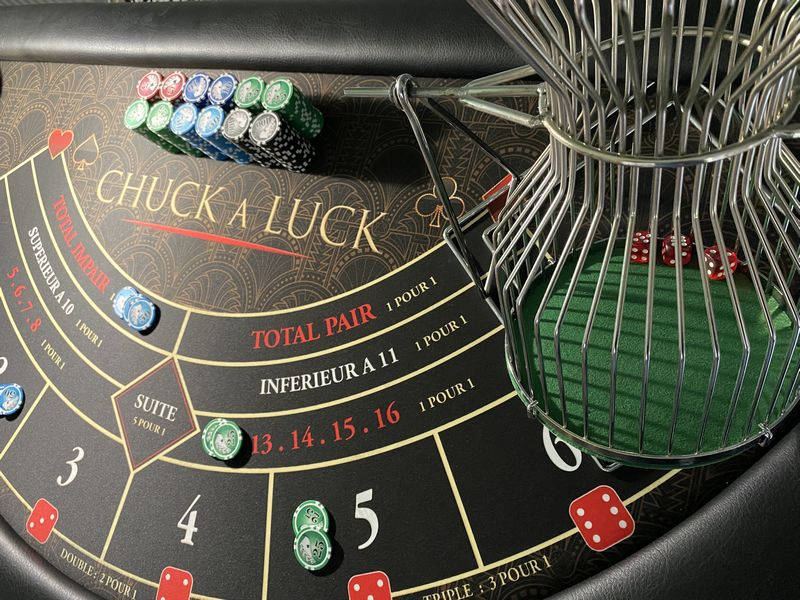

# chuck-a-luck-simulator <!-- omit from toc -->



<!-- Refer to https://shields.io/badges for usage -->


An R Shiny application simulating the dice game '[Chuck-a-Luck](https://www.dice-play.com/Games/ChuckALuck.htm)' to demonstrate frequentist statistics concepts. Created for DAT004M (Probability and Statistics).

## Table of Contents <!-- omit from toc -->

- [1. Introduction](#1-introduction)
  - [1.1. Rules \& Payouts](#11-rules--payouts)
- [2. Project Structure](#2-project-structure)
- [3. Running the Project](#3-running-the-project)
  - [3.1. Prerequisites](#31-prerequisites)
  - [3.2. CLI Entry Points](#32-cli-entry-points)
  - [3.3. Reproducing the Results](#33-reproducing-the-results)
- [4. References](#4-references)

## 1. Introduction

Chuck-a-Luck (also known as _Bird Cage_) is a simple dice game where players bet on the outcome of three dice.

This application serves as a fun demonstration of the **Law of Large Numbers**, showing how empirical probabilities eventually converge to their theoretical values as the sample size grows. That, and to discourage you from gambling by showing how a well-designed game of chance like Chuck-a-Luck is mathematically guaranteed to take away a portion of your wagers over the long run. Or perhaps to encourage you if the establishment did not do their maths correctly (which is never).

### 1.1. Rules & Payouts

Players place their bets on any number from 1 to 6. The operator then rolls three dice and pays out an amount **relative to the original wager** (on top of returning the wager itself) based on how many dice match the player's chosen number:

| Outcome       | Payout Ratio | Net Win Example               |
| :------------ | :----------- | :---------------------------- |
| **1 Match**   | 1 to 1       | Win \$1 for every \$1 wagered |
| **2 Matches** | 2 to 1       | Win \$2 for every \$1 wagered |
| **3 Matches** | 3 to 1       | Win \$3 for every \$1 wagered |

Payouts may vary across establishments, with some reaching a **12 to 1** payout for 3 matches (winning \$12 for every \$1 wagered). While these odds may appear somewhat favorable to some, the house maintains a significant mathematical advantage. In a standard setup, the house edge is **7.87%**, meaning for every \$100 wagered, the player is statistically expected to lose \$7.87. Even with the increased 12 to 1 payout, the house edge remains at **3.70%**.

## 2. Project Structure

A high-level overview of the repository organization:

```text
.
├── .github/                # CI/CD Workflows (GitHub Actions)
├── docs/                   # Project documentation and reports
│   ├── architecture.md     # Technical design and decisions
│   └── reports/            # Generated documentation and manuals
├── dump/                   # Temporary samples and reference material
├── man/                    # Generated help documentation (.Rd files)
├── tests/                  # Unit testing suite
│   ├── testthat/           # Core component tests
│   └── testthat.R          # Test entry point
├── R/                      # Core logic modules
│   ├── constants.R         # Shared theoretical values and global variables
│   ├── plots.R             # Visualization logic (ggplot2)
│   ├── simulation.R        # RNG engine (vectorized dice rolls)
│   └── statistics.R        # Analytical functions and CI calculations
├── app.R                   # Main Shiny application (UI and Server)
├── DESCRIPTION             # Project manifest and dependency management
├── LICENSE                 # MIT License details
├── Makefile                # Unified development entry points
└── NAMESPACE               # Generated package exports
```

For a detailed look at the internal design, statistical methodology, and architectural decisions, see [architecture.md](docs/architecture.md).

## 3. Running the Project

### 3.1. Prerequisites

To run the simulator and development tools, you will need:

1. **R:** The core environment. Version `4.5.2` or later is recommended.
2. **GNU Make:** (Optional) Highly recommended for automating development tasks (installation, testing, and linting). While all R commands can technically be executed manually, `make` provides a much simpler and standardized interface.

### 3.2. CLI Entry Points

This project provides unified `make` entry points for common tasks:

- **`make run`**: Launches the R Shiny application.
- **`make test`**: Executes the full `testthat` suite.
- **`make lint`**: Runs code quality checks via `lintr`.
- **`make doc`**: Rebuilds the `NAMESPACE`, help files (`man/`), and the PDF manual in `docs/reports/`.
- **`make check`**: Runs the full pre-push lifecycle (doc, format, lint, and test).

### 3.3. Reproducing the Results

1. Clone this repository:

   ```bash
   git clone https://github.com/qu1r0ra/chuck-a-luck-simulator
   ```

2. Navigate to the project root and install all dependencies:

   ```bash
   cd chuck-a-luck-simulator
   make install
   ```

3. Start the application:

   ```bash
   make run
   ```

## 4. References

[1] "Chuck-A-Luck," _Dice Play_. <https://www.dice-play.com/Games/ChuckALuck.htm>

[2] "Chuck-a-Luck," _Wizard of Odds_. <https://wizardofodds.com/games/chuck-a-luck/>

[3] Taboga, Marco (2021). "Law of Large Numbers", Lectures on probability theory and mathematical statistics. Kindle Direct Publishing. Online appendix. <https://www.statlect.com/asymptotic-theory/law-of-large-numbers>.
